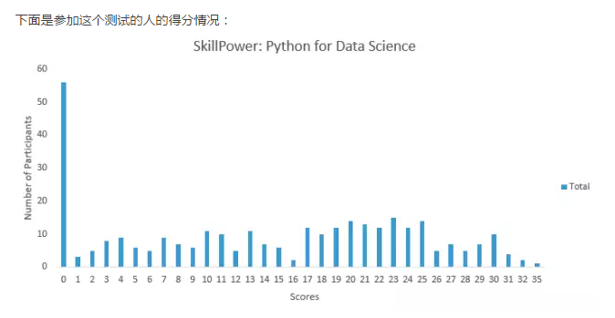
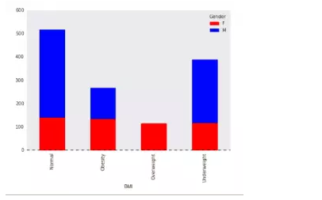

# 40个问题测试你在数据科学方面的python水平

**2017-05-24  <font color=blue face="微软雅黑">Python程序员**</font> 

<font color=red><div align="center">Python部落（python.freelycode.com）组织翻译，禁止转载，欢迎转发。</div></font>

毫无疑问python在数据科学者中越来越受欢迎了，重要的一点就是它为通用编程语言带来一个完整的体系。使用Python你不仅可以转换操作数据，而且还可以在单一体系中创建强大的管道命令和机器学习流程。

在Analytics Vidhya，我们都非常喜欢使用python，大多数人拿它作为机器学习的首选工具。另外，如果你想学习深度学习，很明显，python在这领域有着比其它编程语言更大的优势，它已经形成了一个成熟的生态体系。

如果你正在为数据科学而学习python，那么这个测试可以用来帮助评估你在这方面的python水平。该测试时作为DataFest2017的一部分进行的，总共近1300人参加了这些测试，其中超过300人参加了此次测试。

下面是参加这个测试的人的得分情况：



你可以在这个网址获得最终的得分情况：<https://datahack.analyticsvidhya.com/contest/avdatafest-powertool-python-for-data-science/lb>

下面列出一些统计结果：

+ 平均分：14.16
+ 中位数：15
+ 众数：0

## **<font color=MidnightBlue>Questions & Answers**</font>

### <font color=Brown>**问题1描述；**</font>

想必你肯定看过"How I met your mother"这个娱乐节目，当他们在玩这个游戏时，一旦有人说"but,um",那么每个人都必须喝一杯饮料。现在我想改变一下这个游戏，用你的技术来玩这个游戏。游戏的目的就是你需要写一个代码来确定一个人在整个游戏中喝了多少杯饮料。

以下是一个样本字段。

提示：已经导入了python的正则表达式库re

```
txt='''450
00:17:53,457 --> 00:17:56,157
Okay, but, um,
thanks for being with us.

451
00:17:56,175 --> 00:17:58,616
But, um, if there's any
college kids watching,

452 
00:17:58,616 --> 00:18:01,610
But, um, but, um, but, um,
but, um, but, um,

453
00:18:01,610 --> 00：18:03,656
We have to drink, professor.

454
00:18:03,656 --> 00:18:07,507
Tt's the rules.
She said "But, um"

455
00:18:09,788 --> 00:18:12,515
But, um, but, um, but, um...
god help us all.
'''
```

1) 下面哪一个代码能完成这个任务？

```
A） len(re.findall('But, um',txt))

B)re.search('But, um',txt).count()

C)len(re.findall('[B,b]ut,um',txt))

D)re.search('[B,b]ut, um', txt).count()
```

<font color=blue>**答案（C）**</font>

你需要找到所有的大小写字母"but",所以C是正确的

### <font color=Brown>**问题2描述**</font>

给定以下字符串：

```
str = """Email_Address,Nickname,Group_Status,Join_Year
        aa@aaa.com,aa,Owner,2014
        bb@bbb.com,bb,Member,2015
        cc@ccc.com,cc,Member,2017
        dd@ddd.com,dd,Member,2016
        ee@eee.com,ee,Member,2020
    """
```

为了从上面的字符串中提取出Email地址的域名（例如"aaa","bbb",...）,你写了下面的代码：

```
for i in re.finditer('([a-zA-Z])+)@([a-zA-Z]+).(com)',str):
    print i.group(__)
```

2） 上面代码中的"__"处应该填写什么是数字呢？

提示：已经导入了python的正则表达式库re

```
    A) 0

    B) 1

    C) 2

    D) 3
````


<font color=blue>**答案（C）</font>**

参看正则表达式语法

### <font color=Brown>**问题3描述</font>**

你的朋友有个假设- "所有那些以字母" y "发音结尾的人（例如：Hollie）都是聪明的人。"请注意：这个名字应该以"y"的发音结束，而不能以字母"y"结尾。现在，你需要根据这个假设从你们学校网站上抓取出这些数据。下面是已经收集到的数据

Name | Marks 
:----|:----
Andy | 0
Mandi | 10
Sandy | 20
Hollie | 18
Molly | 19
Dollie | 15

你写下面的代码来列出所有符合这个假设的人的名单：

```
temp = []
 for i in re,finditer(pattern,str):
    temp.apppend(i.group(1))
```

3)在正则表达式中，"pattern"处应该怎么写？

```
    A) pattern = '(i|ie)(,)'

    B)pattern = '(i$|ie$)(,)'

    C)pattern = '([a-zA-A]+i|[a-zA-Z]+ie)(,)'

    D)都不对
```

<font color=blue>**答案（B）**</font>

你需要找出所有以"I"或"ie"结尾的字符串，所以B是正确的。

### <font color=Brown>**问题4描述</font>**
给出下面两个列表：

```
a = [1,2,3,4,5]

b = [6,7,8,9]
```

现在下需要将两个列表的元素合在一块形成一个新的列表，如下

```
a = [1,2,3,4,5,6,7,8,9]
```

4)你会选择下面哪个选项呢？

```
    A) a.append(b)

    B) a.extend(b)

    C) 以上都对

    D）以上都不对

```
<font color=blue>**答案（B）</font>**

5）假设你已经建立了一个机器学习模型，但是你现在不想用它，过一会再使用。下面哪个命令能满足这个要求？

提示：库pickle已被导入为pkl

A） push(model, "file")

B) save(model, "file")

C) dump(model, "file")

D) freeze(model, "file")

<font color=blue>**答案（C）**</font>

### <font color=brown>**问题6描述**</font>

将下面的字符串转换成日期值

```
import time
str = '21/01/2017'
datetime_value = time.strptime(str,date_format)
```

6)为了实现这个目的，"date_format"处的表达式应该填写出什么？

```
    A) "%d/%m/%y"

    B)"%D/%M/%Y"

    C)"%d/%M/%y"

    D)"%d/%m/%Y"
```

<font color=blue>**答案（D）**</font>

我已经建立了一个简单的神经网络用语图像识别问题。现在，我想测试是否为隐藏层正确设置了权重和偏差。为了实现这个目的，我需要一个单位矩阵作为输入。以下是我的单位矩阵：

```
A = [1,0,0
      0,1,0
      0,0,1]
```

7）在python中如何生成这样的单位矩阵？

提示：库numpy已导入为np

```
    A) np.eye(3)

    B) identity(3)

    C) np.array([1,0,0],[0,1,0],[0,0,1])

    D)以上都可以
```

<font color=blue>**答案（A）**</font>

选项B应该为np.identity(),选项C的语法是错误的。

8）为了检测两个数组是否占据了同样的空间，应该怎么做？

例如，这里有两个数组

```
    print e
    [1,2,3,2,3,4,4,5,6]
    |
    print f
    [[1,2,3]，[2,3,4],[4,5,6]]
```

当你改变第一个数组的值时，第二个数组也会随着改变。如下所示将第一个数组的钱五个数改为0，那么最终两个数组的输出结果如下：

```
    print e[:5]

    0
    |
    print e

    [0,0,0,0,0,4,4,5,6]

    print f

    [[0,0,0],[0,0,4],[4,5,6]]
```

A)检查两个数组的内存，如果相互匹配就是一样的

B）看"np.array_equal(e,f)"的输出，如果结果是"True"，那么他们是一样的

C)输出"e.flags"和"f.flags"的值，如果其中一个是"False",则这两个数组分配了同样的空间

D）以上都不对

<font color=blue>**答案（A）**</font>

### <font color=Brown>**问题9描述</font>**

假设你要将训练数组（train\_set）和测试数组(test\_set)都加入到结果数组（resulting_set）中做数据处理，如下；

```
    train_set = np.array([1,2,3])
    test_set = np.array([[0,1,2],[1,2,3]])
    resulting_set --> [[1,2,3],[0,1,2],[1,2,3]]
```

9）你怎样合并这两个数组？

```
    A) resulting_set = train_set.append(test_set)

    B) resulting_set = np.concatenate([train_set,test_set])

    C) resulting_set = np.vstack([train_set,test_seT])

    D) 以上都不对
```

<font color=blue>**答案（C）</font>**

A和B都是水平放置，但是结果应该是垂直放置

### <font color=Brown>**问题10描述**</font>

假设你正在调节Iris数据集的随机数分布参数

Sepal_length | Sepal_width | Petal_length | Petal_width | Species
:---|:---|:---|:---|:---
4.6|3.2|1.4|0.2|Iris-setosa
5.3|3.7|1.5|0.2|Iris-setosa
5.0|3.3|1.4|0.2|Iris-setosa
7.0|3.2|4.7|1.4|Iris-versicolor
6.4|3.2|4.5|1.5|Iris-versicolor

10）对于"random_state(Seed value)",下面哪个是最好的值？

```
    A) np.random.seed(1)
    
    B) np.random.seed(40)

    C) np.random.seed(32)

    D) 不知道
```

<font color=blue>**答案（D）</font>**

这里没有最好的值，它取决于数据的具体情况

### <font color=Brown>**问题11描述</font>**

当用numpy读取csv文件时，你希望自动填充在"Date_Of_Joining"列丢失的日期值"01/01/2010"

Name|Age|Date_Of_Joining|Total_Experience
:---|:---|:---|:---
Andy|20|01/02/2013|0
Mandy|30|01/05/2014|10
Sandy|10| |0
Bandy|40|01/10/2009|20

11）下面哪个命令能在读取文件的同时补充丢失的值？

提示：库numpy已导入为np

```
    A) filling_values = ("_",0,01/01/2010,0)
    temp = np.genfromtxt(filename,filling_values=filling_values)
    
    B) filling_values = ("_",0,01/01/2010,0)
    temp = np.loadtxt(filename,filling_values=filling_values)

    C) filling_values = ("_",0,01/01/2010,0)
    temp = np.gentxt(filename,filling_values=filling_values)

    D) 都不过
```

<font color=blue>**答案（A）**</font>

12）在sklearn中如何导入一个决策树分类器？

```
    A) from sklearn.decision_tree import DecisionTreeClassifier

    B) from sklearn.ensemble import DecisionTreeClassifier

    C) from sklearn.tree import DecisionTreeClassifier

    D) 都不对
```

<font color=blue>**答案（C）**</font>

13）您已将数据集以csv的格式上传到Goole的电子表格上并公开分享了。现在你想在Python中访问它，该怎么做？

提示：已导入StingIO库

```
    A) link = https://docs.google.com/spreadsheets/d/d...source # \StringIO.StringIO(requests.get(link).comtent))
    data = pd.read_csv(source)

    B) link = https://docs.google.com/spreadsheets/d/d...source # \StringIO(requests.get(link).comtent))
      data = pd.read_csv(source)

    C) link = https://docs.google.com/spreadsheets/d/d...source # \StringIO(requests.get(link).comtent))
      data = pd.read_csv(source)

    D) 都不对
```

<font color=blue>**答案（A）**</font>

### <font color=Brown>**问题14描述</font>**

假设你有个3行2列的数据导入到pandas

```
    train = pd.DataFrame({'id':[1,2,4],'features':[["A","B","C"],\["A","D","E"],["C","D","F"]]})
```

现在你想在"features"列使用lambda函数

```
    train['features_t'] = train["features"].apply(lambda x:\" ".join(["_".join(i.split("")) for i in x]))
```

14）下面的命令将会输出什么？

```
    print train['features_t']

    A)
    0  A B C
    1  A D F
    2  C D F

    B)
    0  A B
    1  A D F
    2  C D F

    C) Error

    D) 都不对
```

<font color=blue>**答案（A）**</font>

### **<font color=Brown>问题15描述</font>**

我们有一个根据葡萄酒属性来预测其质量的多类别分类问题，现在数据“df”以dataframe的格式被导入了

fixed acidity|volatile acidity|citric acid| residual sugar|chlorides|free sulfur dioxide|total sulfur dioxide|density|pH|sulphates| Alcohol| quality
:---|:---|:---|:---|:---|:---|:---|:---|:---|:---|:---|:---
7.4|0.70|0.00|1.9|0.076|11|34|0.9978|3.51|0.56|9.4|5
7.8|0.88|0.00|2.6|0.098|25|67|0.9968|3.20|0.68|9.8|5
7.8|0.76|0.04|2.3|0.092|15|54|0.9970|3.26|0.65|9.8|5
11.2|0.28|0.56|1.9|0.075|17|60|0.9980|3.16|0.58|98|6
7.4|0.70|0.00|1.9|0.076|11|34|0.9978|3.51|0.56|9.4|5

表示质量那列的值目前为1到10，现在要用二进制问题来代替，大于5的输出为1，其它的输出为0

15）下面哪个代码能完成这个任务？

提示：库numpy已导入为np

```
    A)
    Y = df[quality].values
    Y = np.array([1 if y >= 6 else 0 for y in Y])

    B)
    Y = df[quality].values
    Y = np.array([1 if y >= 6 else 1 for y in Y])

    C)
    Y = df[quality]
    Y = np.array([1 if y >= 6 else 1 for y in Y])

    D)都不对
```

<font color=blue>**答案（A）**</font>

### <font color=Brown>**问题16描述</font>**

假设有一个DataFrame类型的数据

```
    df = pd.DataFrame(['ff','gg','hh','yy'],[24,12,48,30],columns = ['Name','Age'])
```

16）下面给出的两种表达式有什么不同？

```
    1.  df['Name']
    2.  df.loc[:,'Name']

    A) 2是原始数据，1是拷贝

    B）1是原始数据，2是拷贝

    C）两个都是拷贝

    D）两个都是原始数据
```

<font color=blue>**答案（B）**</font>

### <font color=Brown>**问题17描述</font>**

考虑一个函数“fun”

```
    def fun(x):
        x[0] = 5
        return x
```

17）现在你输入了一个包含3个数的列表，下面的语句将会输出哪个结果？

```
    g = [10,11,12]

    print fun(g), g

    A) [5, 11, 12] [5, 11, 12]

    B) [5, 11, 12] [10, 11, 12]

    C)[10, 11, 12] [10, 11, 12]

    D)[10, 11, 12] [5, 11, 12]
```

<font color=blue>**答案（A）**</font>
### <font color=Brown>**问题18描述</font>**

Sibmoid函数经常用来创建神经网络激活功能，他的定义如下：

```
    def sigmoid(x):
        return(1 / (1 + math.exp(-x)))
```

18) 找到sigmoid函数的衍生函数是非常重要的，下面哪个选项能完成这个任务？

```
    A）
    import scipy
    Dv = scipy.misc.derive(sigmoid)

    B)
    from sympy imort *
    x = symbol(x)
    y = sigmoid(x)
    Dv = y.differentiate(x)

    C)
    Dv = sigmoid(x)*(1 - sigmoid(x))

    D) 都不对
```

<font color=blue>**答案（C）**</font>
### <font color=Brown>**问题19描述</font>**

将一个按月记录的数据转换为按日记录，如下：

ID|Electricity Usage|Month
:---|:---|:---
1|2000|1
2|20|2
3|4000|3
4|40|4


ID|Electricity Usage|Date|Month
:---|:---|:---|:---
1|100|1|1
1|100|2|1
1|100|3|1
1|100|4|1
1|100|5|1

首先你必须将数据扩充到每个月（假设每月是30天）

19）下面哪个代码能实现？

```
    A) new_df = pd.concat([df]*30，index = False)

    B) new_df = pd.concat([df]*30,ignore_index=True)

    C) new_df = pd.concat([df]*30,ignore_index=False)

    D) 都不对
```

<font color=blue>**答案（B）**</font>
### <font color=Brown>**问题20-22**</font>

给出DataFrame格式的数据df

```
    df = pd.DataFrame({'Click_Id':['A','B','C','D','E'],\'Count':[100,200,300,400,250]})
```

20）现在要将df中的列"Count"改为"Click-Count".有如下代码，那么最终的语句将会输出什么？

提示：库Pandas已导入为pd

```
    df.rename(colums = {'Count':'Click_Count'})

    print df.columns

    A) ['Click_Id','Click_Count']

    B) ['Click_Id','Count']

    C) Error

    D) 都不对
```

<font color=blue>**答案（B）**</font>

21) 在许多数据科学项目中，需要将DataFrame格式转化成字典，现在要将"df"转化成为"Click_Id"为键，"Count"为值得字典，下面哪个选项能满足要求？
提示：库Pandas已导入为pd

```
    A) set_index('Click_Id')['Count'].to_dict()

    B) set_index('Count')['Click_Id'].to_dict()

    C)因为DataFrame与字典的数据结构不同，所以不能完成这个操作

    D）以上都不对
```

<font color=blue>**答案（A）**</font>

22）假设要将"df"的值分配给"df1",以便将来能用"df1"回复原来的数据，现在你改变了"df"中"Count"中的一些值，那么下面的语句将会输出什么？

```
    df1 = df
    df.loc[df.Click_Id == 'A','Count'] += 100
    print df.Count.values,df1.Count.values

    A) [200 200 300 400 250] [200 200 300 400 250]

    B) [100 200 300 400 250] [100 200 300 400 250]

    C) [200 200 300 400 250] [100 200 300 400 250]

    D) 都不对
```
<font color=blue>**答案（A）**</font>

23）你花了很长时间写了个预处理数据的代码，为了知道每行代码花了多少时间，你在代码里插入了个标记。为了实现这个目的，你将会采取哪些措施？

```
    1.将time.slreep（）放入到代码中，看代码花了多长时间
    2.将time.time()放入到代码中，看过了多长时间
    3.将datatime.timedelta()放入代码中，看运行时间的差别
    4.将整个代码拷贝到Ipython或Jupyter  notebook,每一行都作为一个单独的块来运行

    A) 1 & 2 
    B) 1,2 & 3
    C) 1,2 & 4
    D) 以上都可以
```

<font color=blue>**答案（C）**</font>

24）怎样用pandas跳过前三行进行数据读取？
提示：库Pandas已盗取为pd，数据格式如下（email.csv）:

```
    ,,,
    ,,,
    ,,,
    Email_Address,Nickname,Group_Status,Join_Year
    aa@aaa.com,aa,Owner,2014
    bb@bbb.com,bb,Member,2015
    cc@ccc.com,cc,Member,2017
    dd@ddd.com,dd,Member,2016

    A) read_csv('email.csv',skip_rows=3)

    B) read_csv('email.csv',skiprows=3)

    C) read_csv('email.csv',skip=3)

    D)都不对
```

<font color=blue>**答案（B）**</font>

25）应该写什么方法产生如下的结果？
给出DataFrame类型数据"df"

EMPID|Gender|Age|Sales|BMI|Income
:---|:---|:---|:---|:---|:---
E001|M|34|123|Normal|350
E002|F|40|114|Overweight|450
E003|F|37|135|Obesity|169
E004|M|30|139|Underweight|189
E005|F|44|117|Underweight|183
E006|M|36|121|Normal|80
E007|M|32|133|Obesity|166
E008|F|26|140|Normal|20
E009|M|32|133|Normal|75
E010|M|36|133|Underweight|40

现在要知道BMI和Gender对Sales产生的影响，画了下面的条状图



代码如下：

```
    var = df.groupby(['BMI','Gender']).Sales.sum()
    var.unstack().plot(kind='bar', method, color=['red','blue'],grid=False)

    A) stacked=True

    B) stacked=False

    C) stack=False

    D)都不对
```

<font color=blue>**答案（A）**</font>

这是一个堆叠的条状图

26）给出两个列表，在这两个列表中有些值是一样的，下面哪个代码能找出在"City\_A"而不再"City\_B"的值？

```
    City_A = ['1','2','3','4']
    City_B = ['2','3','4','5']

    A) [i for i in City_A if i not in City_B]

    B) [i for i in City_B if i not in City_A]

    C) [i for i in City_A if i in City_B]

    D) 都不对
```

<font color=blue>**答案（A）**</font>
### <font color=Brown>**问题27描述</font>**

假设你用pandas读取"temp.csv"文件遇到了下面的错误

```
    Traceback (most recent call last):
    File "<input>", line 1,in<module>
    UnicodeEncodeError: 'ascii' codec can't encode character.
```

27）下面哪个选项能纠正这个错误？
提示：库pandas已导入为pd

```
    A) pd.read_csv("temp.csv", compression='gzip')

    B) pd.read_csv("temp.csv",dialect='str')

    C) pd.read_csv("temp.csv",encoding='utf-8')

    D) 都不对
```

<font color=blue>**答案（C）**</font>

28）假设你定义了一个元祖，现在要将索引为2的值改为10，你会选择下面哪个选项？

```
    tup = (1, 2, 3, 4, 5 )

    A) tup(2) = 10

    B) tup[2] = 10

    C) tup{2} = 10

    D) 都不对
``` 

<font color=blue>**答案（D）**</font>

元祖的数不能改变

29）你想访问url为"www.abcd.org"的网站，下面哪个选项能完成这个任务？

```
    A) urllib2.urlopen(www.abcd.org)

    B) requests.get(www.abcd.org)

    C) |A and B

    D) 都不可以
```

<font color=blue>**答案（C）**</font>
### <font color=Brown>**问题30描述**</font>

给出下面的网页

```
    html_doc = """
    <!DOCTYPE html>
    <htmllang="en">
    <head>
    <metacharset="utf-8">
    <metaname="viewport" content="width=device-width">
    <title>udacity/deep-learning: Repo for the Deep Learning Nandegree \ Foundations program.</title>
    <linkrel="search" type="application/opensearchdescription+xml" href=\"/opensearch.xml" title="GitHub">
    <linkrel="fluid-icon" href="https://github.com/fluidicon.png" title="GitHub">
    <metaproperty="fb:app_id"  content="1401488693436528">
    <linkrel="assets" href="https://assets-cdn.github.com/">
    ...
    """
```

30)用BeautifulSoup模块读取这个网页的标题，下面哪个代码是正确的？
提示：您必须在标题标签中提取文本

```
    A)
    from bs4 import BeautifulSoup
    soup =BeautifulSoup(html_doc,'html.parser')
    print soup.title.name

    B)
    from bs4 import BeautifulSoup
    soup =BeautifulSoup(html_doc,'html.parser')
    print soup.title.string

    C)
    from bs4 import BeautifulSoup
    soup =BeautifulSoup(html_doc,'html.parser')
    print soup.title.get_text

    D) 都不对

```

<font color=blue>**答案（B）**</font>
### <font color=Brown>**问题31描述**</font>

假设给出DataFrame数据结构的条目，现在，您要使用LabelEncoder在此列表上应用标签编码进行导入和转换。

```
    D = ['A','B','C','D','E','AA','AB']
    from sklearn.preprocessing import LabelEncoder
    le = LabelEncoder()
```

31）下面的语句将会输出什么？

```
    print le.fit_transform

    A) arry([0,2,3,4,5,6,1])

    B) arry([0,3,4,5,6,1,2])

    C) arry([0,2,3,4,5,1,6])

    D)以上都可以
```

<font color=blue>**答案（D）**</font>

32） 下面的语句将会输出什么？

```
    import numpy as np
    df = pd.DataFrame({'Id':[1,2,3,4],'val':[2,5,np.nan,6]})
    print df.vl == np.nan

    A)
    0   False
    1    False
    2   False
    3    False

    B)
    0   False
    1   False
    2   True
    3   False

    C)
    0 True
    1   True
    2   True
    3   True

    D）都不对
```

<font color=blue>**答案（A）**</font>

33）假设数据被存储为HDFS格式，为了找到这种结构的数据，下面哪条命令能找到HDFS键的名字？

```
    A) hf.key()

    B) hf.key

    C) hf.keys()

    D) 都不对
```

<font color=blue>**答案（C）**</font>
### <font color=Brown>**问题34描述**</font>
下面是个影评

```
    reviews = ['movie is unwatchable no matter how decent the first half is . \','somewhat funny and well paced action thriller that has \ jamie foxx as a hapless fast talking hoodlum who is chosen \ by
    an overly demanding','morse is okay as the agent who comes\up with the ingenious plan to get whoever did it at all cost.']
```

你的任务时从上面的影评中找出表示情绪的词，为此，你必须要写一个代码来查找所有句子中单个单词的数量

34）用下面哪个值来分割单词？

```
    counts = Counter()
    for i in range(len(reviews)):
        for word in reviews[i].split(value):
            counts[word] += 1

    A)  ' '

    B)  ','

    C)  '.'

    D)  都不对
```

<font color=blue>**答案（A）**</font>

35）如何设置下图的线宽？


上图的代码如下：

```
    import matplotlib.pyplot as plt
    plt.plot([1,2,3,4])
    plt.show()

    A)  In line two, write plt.plot([1,2,3,4], width=3)

    B)  In line two, write plt.plot([1,2,3,4], line_width=3)

    C)  In line two, write plt.plot([1,2,3,4], lw=3)

    D)  都不对
```

<font color=blue>**答案（C）**</font>

36）如何重置DataFrame数据结构的索引？新的索引值如下：

```
    new_index=['Safari','Iceweasel','Comodo Dragon','IE10','Chrome']
```

提示：df是一个DataFrame数据，如下：

||http_status|response_tme
:---|:---|:----
Firefox|200|0.04
Chrome|200|0.02
Safair|404|0.07
IE10|404|0.08
Konqueror|301|1.00

```
    A) df.reset_index(new_index,)

    B) df.reindex(new_index,)

    C) df.reindex_like(new_index,)

    D) 都不对
```

<font color=blue>**答案（A）**</font>

37）根据乘客人数确定乘客人数的比例。

||Passengerid|Survived|Pclass|Name|Sex|Age|SibSp|Parch|Ticket|Fare|Cabin|Embarked
:---|:---|:---|:---|:---|:---|:---|:---|:---|:---|:---|:---|:---
0|1|0|3|Braund.Mr.OwenHamis|male|22.0|1|0|A/5 21171|72500|NaN|S
1|2|1|1|Cumings.Mrs.John Bradiey(Florence Briggs Th...)|female|38.0|1|0|PC 17599|712833|C85|C
2|3|1|3|Heikkinen.Miss.Laina|female|26.0|0|0|STON/O2 3101282|79250|NaN|S
3|4|1|1|Futrelle.Mrs.Jacques Heath(Lily May peel)|female|35.0|1|0|113803|531000|C123|S
4|5|0|3|Allen.mr.William Henry|male|35.0|0|0|373450|80500|NaN|S

```
    A)  crosstab(df\_train['Pclass'], df\_train['Survived'])

    B)  proportion(df\_train['Pclass'], df\_train['Survived'])

    C)  crosstab(df\_train['Survived'], df\_train['Pclass'])

    D)  都不对
```

<font color=blue>**答案（A）**</font>

38)编写一个通用代码来计算文本的“n-gram”，例如“2-gram”的句子是[["this", "is"],["is","a"],["a","sample"],["sample","text"]],下面哪个代码是正确的？
给定的句子是：
 'this is a sample text'.
 
```
    A)
    def generate_ngrams(text,n):
    words = text.split('\n')
    output = [] for i in range(len(words)-n+1):
    append(words[i+1:i+n])
    return output

    B)
    def generate_ngrams(text,n):
    words = text.split()
    output = [] for i in range(len(words)-n+1):
    append(words[i:i+n])
    return output

    C)
    def generate_ngrams(text,n):
    words = text.split()
    output = [] for i in range(len(words)-n+1):
    append(words[i+1:i+n])
    return output

    D)  都不对
```

<font color=blue>**答案（B）**</font>

39）下面哪个代码将会在隐藏索引与标题之后以UTF-8编码的形式导出CSV文件里的DataFrame（df）数据结构

```
    A)
    df_1.to_csv('../data/file.csv',encoding='utf-8',index=True,header=False)

    B)
    df_1.to_csv('../data/file.csv',encoding='utf-8',index=False,header=True)

    C)
    df_1.to_csv('../data/file.csv',encoding='utf-8',index=False,header=False)

    D)  都不对
```

<font color=blue>**答案（C）**</font>

40）以下哪一项能正确表示出均方误差（MSE）？

提示 ：库numpy已导入为np

```
    A)
    def MSE(real_target,predicted_target):
    return np.mean((np.square(real_target) - np.square(predicted_target)))

    B)
    def MSE(real_target,predicted_target):
    return np.mean((real_target - predicted_target)**2))

    C)
    def MSE(real_target,predicted_target):
    return np.sqrt(np.mean((np.mean(real_target) - np.square(predicted_target))))

    D)  都不对
```

<font color=blue>**答案（B）**</font>

## **总结**

如果你正在学习Pyhon，一定要完成上面的测试，这不仅能帮助评估你的技术水平，而且还可以看到自己在这个论坛中处于什么面样的位置，总之，这将会更清楚的认清自己的现状。另外如果有什么问题或疑问，欢迎随时交流！

英文原文：https://www.analyticsvidhya.com/blog/2017/05/questions-python-for-data-science/ 
译者：buhaoxuesheng
